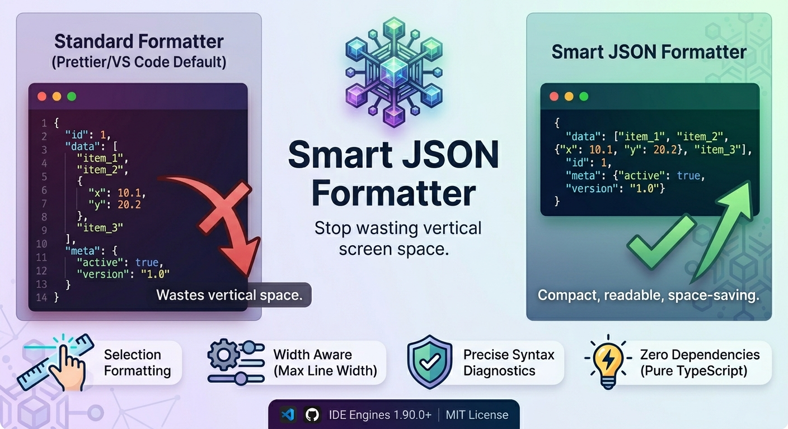

# Smart JSON Formatter

<p align="center">
  
</p>

**Stop wasting vertical screen space.**

Smart JSON Formatter is a "fractal" JSON formatter for VS Code and compatible IDEs. Unlike standard formatters that force every item onto a new line (wasting space on simple arrays or short objects), this extension intelligently groups simple lists and objects onto single lines while keeping complex, nested structures expanded.

It optimizes for both **readability** and **information density**.

🛍️ **[Install from the VS Code Marketplace](https://marketplace.visualstudio.com/items?itemName=deiividramirez.smart-json-formatter)**

👉 **[Try the Live Interactive Demo!](https://deiividramirez.github.io/smart-json-formatter/)**

---

## 🚀 Features

*   **Fractal Formatting:** Intelligently decides if a list or object is simple enough to fit on a single line.
*   **Zero Dependencies:** 100% written in pure TypeScript. No Python, Node CLI subprocesses, or other system requirements are needed.
*   **Selection Formatting (Range):** Format only a selected portion of a document (e.g. just a specific nested object or array) instead of the whole file.
*   **Width Aware:** Respects a maximum line width limit. If the formatted line would exceed this limit, it automatically expands to multiple lines.
*   **Precise Syntax Diagnostics:** If the JSON is invalid, the extension points out the exact line and column number of the syntax error.
*   **Comments Supported (JSONC):** Handles comments (`//` and `/* */`) gracefully when formatting JSONC documents.

---

## ↔️ Comparison

<p align="center">
  
</p>

### Standard Formatter (Prettier / VS Code Default)
*Wastes vertical space on simple values and coordinates:*

```json
{
  "id": 1,
  "name": "Camera Settings",
  "position": [
    12.5,
    45.2,
    0.0
  ],
  "flags": [
    "enabled",
    "visible",
    "locked"
  ]
}
```

### Smart JSON Formatter
*Compact, readable, and space-saving:*

```json
{
  "flags": ["enabled", "visible", "locked"],
  "id": 1,
  "name": "Camera Settings",
  "position": [12.5, 45.2, 0.0]
}
```

---

## ⚙️ Configuration Settings

Configure the formatter to match your project guidelines via the VS Code settings UI or `settings.json`:

| Setting | Type | Default | Description |
| :--- | :--- | :--- | :--- |
| `smartJsonFormatter.indent` | `number` | `2` | Number of spaces to use for indentation. |
| `smartJsonFormatter.maxWidth` | `number` | `120` | Maximum line width before expanding an object or array onto multiple lines. |
| `smartJsonFormatter.sortKeysAlphabetically` | `boolean` | `true` | When true, object keys are sorted alphabetically when formatting. |
| `smartJsonFormatter.stripComments` | `boolean` | `true` | Strip `//` and `/* */` comments before parsing. When false, files with comments will produce formatting errors. |

---

## 💻 Usage

### Format Entire Document
1. Open any `.json` or `.jsonc` file.
2. Right-click the editor and select **Format Document With...**
3. Choose **Smart JSON Formatter**.
4. (Optional) To make it default, select **Configure Default Formatter...** and choose **Smart JSON Formatter**.
5. Trigger at any time with `Shift + Alt + F` (macOS: `Shift + Option + F`).

### Format Selected Text
1. Highlight a portion of JSON in any file.
2. Right-click the selection and click **Format Selection** (or press `Ctrl+K Ctrl+F` / macOS: `Cmd+K Cmd+F`).

---

## 🛡️ Compatibility

*   **IDE Engines:** Compatible with VS Code/IDE version `1.90.0` or newer (including Antigravity client `1.107.0` and above).
*   **Operating Systems:** Works out-of-the-box on Linux, macOS, and Windows.

---

## 🔧 Troubleshooting

### "JSON Format Failed: Unexpected token..."
*   **Invalid JSON:** The extension requires syntactically valid JSON. Review the line and column number reported in the error Toast to fix the syntax issue.
*   **Comments failing:** If you are formatting a file with comments (like VS Code configs), make sure `smartJsonFormatter.stripComments` is set to `true` (default) or that you format the document as **JSON with Comments (jsonc)**.

---

## 📄 License
MIT License
